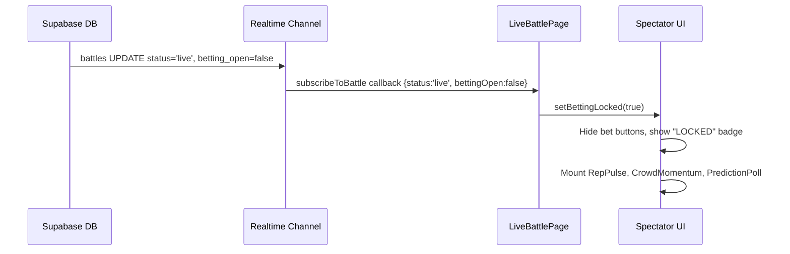
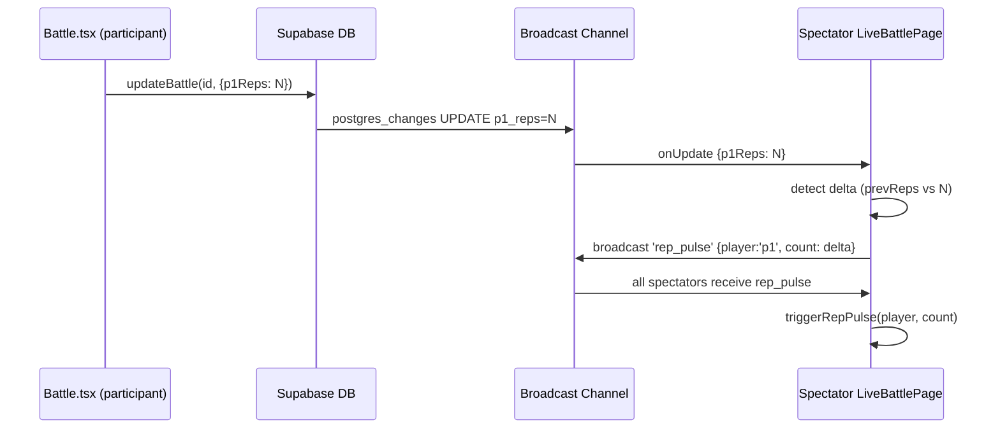
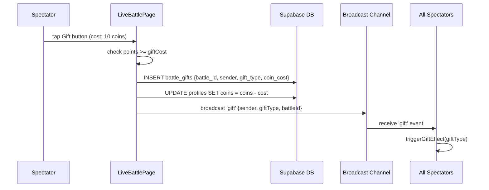

# Design Document: Livestream Battle Experience

## Overview

The Livestream Battle Experience transforms the existing `LiveBattlePage` spectator view into a high-fidelity, real-time stadium atmosphere using Supabase Realtime — no video streaming required. When a battle's status transitions to `"live"`, betting locks and the UI shifts entirely to social engagement: a crowd prediction poll, a Rep Pulse animation that fires on every rep update, a Crowd Momentum meter, floating emoji hype reactions, and a Gifts mechanic where small coin spends trigger full-screen visual effects.

All real-time data flows through Supabase Realtime channels already established in `lib/db.ts` (`subscribeToBattle`). The feature extends that subscription to carry new event types (`rep_pulse`, `reaction`, `gift`, `poll_vote`) via Supabase Broadcast, keeping the existing `battles` table schema intact and adding only two lightweight new tables (`battle_gifts`, `battle_poll_votes`).

The design spine follows the existing app aesthetic: serif-italic typography (`font-serif italic`), 3D tactile buttons (`shadow-[0_Npx_0_color]` with `active:translate-y`), and soft-shadowed containers (`shadow-sm`, `border-2 border-gray-100`).

---

## Architecture

```mermaid
graph TD
    subgraph Client
        LBP[LiveBattlePage]
        RP[RepPulse Component]
        CM[CrowdMomentum Component]
        HR[HypeReactions Component]
        GFX[GiftEffect Component]
        PP[PredictionPoll Component]
    end

    subgraph Supabase Realtime
        BC[Broadcast Channel\nbattle:{id}]
        PG[Postgres Changes\nbattles table]
    end

    subgraph Supabase DB
        BT[(battles)]
        BG[(battle_gifts)]
        BPV[(battle_poll_votes)]
    end

    LBP -->|subscribeToBattle extended| BC
    LBP -->|subscribeToBattle existing| PG
    PG -->|p1Reps/p2Reps/status updates| LBP
    BC -->|rep_pulse events| RP
    BC -->|reaction events| HR
    BC -->|gift events| GFX
    BC -->|poll_vote events| PP
    BC -->|momentum delta| CM

    LBP -->|sendRepPulse| BC
    LBP -->|sendReaction| BC
    LBP -->|sendGift| BC
    LBP -->|castPollVote| BPV
    LBP -->|spendCoinsForGift| BG
```

---

## Sequence Diagrams

### Battle Goes Live — Betting Lock



### Rep Pulse Flow



### Gift Send Flow



---

## Components and Interfaces

### Component: `LiveBattlePage` (extended)

**Purpose**: Orchestrates all real-time spectator state. Extends the existing component with livestream-specific subscriptions and child components.

**New Props**: None — all new state is internal.

**New Internal State**:
```typescript
interface LivestreamState {
  bettingLocked: boolean;
  repPulses: RepPulseEvent[];
  momentumScore: number;        // 0–100, decays over time
  pollVotes: Record<string, number>;
  myPollVote: string | null;
  floatingReactions: FloatingReaction[];
  activeGiftEffect: GiftEffect | null;
  spectatorCount: number;
}
```

**Responsibilities**:
- Subscribe to Supabase Broadcast channel for `rep_pulse`, `reaction`, `gift`, `poll_vote` events
- Lock betting UI when `battle.status === 'live'`
- Derive momentum delta from rep pulse frequency
- Render child components: `RepPulse`, `CrowdMomentum`, `HypeReactions`, `GiftEffect`, `PredictionPoll`

---

### Component: `RepPulse`

**Purpose**: Renders animated burst indicators that pop on every rep increment for either player.

**Interface**:
```typescript
interface RepPulseProps {
  pulses: RepPulseEvent[];
  side: 'p1' | 'p2';
}

interface RepPulseEvent {
  id: string;
  player: 'p1' | 'p2';
  count: number;
  timestamp: number;
}
```

**Responsibilities**:
- Render a burst animation (`scale-0 → scale-150 → scale-0`) per pulse event
- Auto-remove pulses after animation completes (~600ms)
- Stack multiple rapid pulses with slight offset

---

### Component: `CrowdMomentum`

**Purpose**: A horizontal meter (0–100) that fills toward the leading player's side, visualizing crowd energy intensity.

**Interface**:
```typescript
interface CrowdMomentumProps {
  p1Name: string;
  p2Name: string;
  momentumScore: number;  // 0=full p2, 50=neutral, 100=full p1
}
```

**Responsibilities**:
- Render a split bar with smooth CSS transitions
- Color: blue side for p1, red side for p2
- Pulse the dominant side when momentum > 70 or < 30
- Label shows "CROWD WITH {name}" when momentum is decisive (>65 or <35)

---

### Component: `HypeReactions`

**Purpose**: Floating emoji reactions that animate upward and fade out, triggered by spectator taps.

**Interface**:
```typescript
interface HypeReactionsProps {
  reactions: FloatingReaction[];
  onReact: (emoji: string) => void;
}

interface FloatingReaction {
  id: string;
  emoji: string;
  x: number;       // % from left, randomized
  timestamp: number;
}
```

**Responsibilities**:
- Render emoji tray at bottom (🔥👑😂😡😭)
- Animate each incoming reaction: float upward + fade over 1.5s
- Broadcast reaction to all spectators via Supabase Broadcast
- Debounce sends to max 1 per 300ms per user

---

### Component: `GiftEffect`

**Purpose**: Full-screen overlay effect triggered when any spectator sends a gift.

**Interface**:
```typescript
interface GiftEffectProps {
  effect: GiftEffect | null;
  onComplete: () => void;
}

interface GiftEffect {
  id: string;
  giftType: 'confetti' | 'lightning' | 'crown' | 'fire';
  senderName: string;
  timestamp: number;
}
```

**Responsibilities**:
- Render a 2–3 second full-screen CSS animation overlay
- Show sender name + gift type label
- Auto-dismiss after animation; call `onComplete`
- Queue multiple gifts (show one at a time, FIFO)

---

### Component: `PredictionPoll`

**Purpose**: "Who Will Win" crowd prediction poll, visible only during live battles.

**Interface**:
```typescript
interface PredictionPollProps {
  p1Name: string;
  p2Name: string;
  votes: Record<string, number>;  // { [playerName]: voteCount }
  myVote: string | null;
  onVote: (playerName: string) => void;
}
```

**Responsibilities**:
- Show two vote bars with live percentage updates
- Allow one vote per user per battle
- Animate bar width changes smoothly
- Persist vote to `battle_poll_votes` table

---

## Data Models

### Extended `LiveBattle` type additions

```typescript
// Additions to existing LiveBattle in types/index.ts
interface LiveBattle {
  // ... existing fields ...
  spectatorCount?: number;
  momentumScore?: number;   // stored ephemerally, not persisted
}
```

### New: `GiftType`

```typescript
type GiftType = 'confetti' | 'lightning' | 'crown' | 'fire';

interface GiftCost {
  confetti: 10;
  lightning: 25;
  crown: 50;
  fire: 15;
}

const GIFT_COSTS: Record<GiftType, number> = {
  confetti: 10,
  lightning: 25,
  crown: 50,
  fire: 15,
};
```

### New DB Table: `battle_gifts`

```sql
CREATE TABLE battle_gifts (
  id          UUID PRIMARY KEY DEFAULT gen_random_uuid(),
  battle_id   TEXT NOT NULL REFERENCES battles(id),
  sender_name TEXT NOT NULL,
  gift_type   TEXT NOT NULL,
  coin_cost   INTEGER NOT NULL,
  created_at  TIMESTAMPTZ DEFAULT now()
);
```

### New DB Table: `battle_poll_votes`

```sql
CREATE TABLE battle_poll_votes (
  id          UUID PRIMARY KEY DEFAULT gen_random_uuid(),
  battle_id   TEXT NOT NULL REFERENCES battles(id),
  voter_name  TEXT NOT NULL,
  voted_for   TEXT NOT NULL,
  created_at  TIMESTAMPTZ DEFAULT now(),
  UNIQUE(battle_id, voter_name)
);
```

### Broadcast Event Payloads

```typescript
type BroadcastEventType = 'rep_pulse' | 'reaction' | 'gift' | 'poll_vote' | 'spectator_count';

interface RepPulseBroadcast {
  type: 'rep_pulse';
  player: 'p1' | 'p2';
  count: number;       // number of new reps in this delta
  timestamp: number;
}

interface ReactionBroadcast {
  type: 'reaction';
  emoji: string;
  senderName: string;
  x: number;          // random horizontal position 10–90%
  timestamp: number;
}

interface GiftBroadcast {
  type: 'gift';
  giftType: GiftType;
  senderName: string;
  timestamp: number;
}

interface PollVoteBroadcast {
  type: 'poll_vote';
  votedFor: string;
  totalVotes: Record<string, number>;
}

interface SpectatorCountBroadcast {
  type: 'spectator_count';
  count: number;
}
```

---

## Algorithmic Pseudocode

### Betting Lock Algorithm

```pascal
ALGORITHM lockBettingOnLive(battleUpdate)
INPUT: battleUpdate of type Partial<LiveBattle>
OUTPUT: void (side effect: UI state mutation)

BEGIN
  IF battleUpdate.status = 'live' THEN
    setBettingLocked(true)
    
    // Transition spectator UI
    hideBetButtons()
    showLiveEngagementPanel()
    mountRepPulseComponent()
    mountCrowdMomentumComponent()
    mountPredictionPoll()
  END IF
END
```

**Preconditions:**
- `battleUpdate` is a valid partial `LiveBattle` object
- Component is mounted and subscribed to `subscribeToBattle`

**Postconditions:**
- If `status === 'live'`, betting UI is permanently hidden for this session
- Live engagement components are mounted exactly once

---

### Rep Pulse Detection Algorithm

```pascal
ALGORITHM detectAndBroadcastRepPulse(prevBattle, nextBattle, channel)
INPUT: prevBattle, nextBattle of type LiveBattle, channel of type RealtimeChannel
OUTPUT: void

BEGIN
  p1Delta ← nextBattle.p1Reps - prevBattle.p1Reps
  p2Delta ← nextBattle.p2Reps - prevBattle.p2Reps

  IF p1Delta > 0 THEN
    broadcast(channel, {
      type: 'rep_pulse',
      player: 'p1',
      count: p1Delta,
      timestamp: Date.now()
    })
    updateMomentum('p1', p1Delta)
  END IF

  IF p2Delta > 0 THEN
    broadcast(channel, {
      type: 'rep_pulse',
      player: 'p2',
      count: p2Delta,
      timestamp: Date.now()
    })
    updateMomentum('p2', p2Delta)
  END IF
END
```

**Preconditions:**
- `prevBattle` and `nextBattle` are non-null
- `channel` is an active Supabase Realtime channel in joined state

**Postconditions:**
- Broadcast fires only when delta > 0 (no spurious pulses)
- Momentum is updated for each player with reps

---

### Crowd Momentum Algorithm

```pascal
ALGORITHM updateMomentum(player, repDelta)
INPUT: player of type 'p1'|'p2', repDelta of type number
OUTPUT: momentumScore of type number (0–100)

CONSTANTS:
  MOMENTUM_GAIN_PER_REP ← 3
  DECAY_RATE ← 0.95   // applied every 2 seconds
  NEUTRAL ← 50

BEGIN
  gain ← repDelta * MOMENTUM_GAIN_PER_REP

  IF player = 'p1' THEN
    momentumScore ← MIN(100, momentumScore + gain)
  ELSE
    momentumScore ← MAX(0, momentumScore - gain)
  END IF

  RETURN momentumScore
END

ALGORITHM decayMomentum()
// Called on 2-second interval
BEGIN
  momentumScore ← momentumScore + (NEUTRAL - momentumScore) * (1 - DECAY_RATE)
  RETURN momentumScore
END
```

**Loop Invariants (decay interval):**
- `momentumScore` always remains in range [0, 100]
- Score drifts toward 50 (neutral) when no reps are recorded

---

### Gift Send Algorithm

```pascal
ALGORITHM sendGift(giftType, senderName, battleId, currentPoints)
INPUT: giftType of type GiftType, senderName, battleId of type string,
       currentPoints of type number
OUTPUT: success of type boolean

BEGIN
  cost ← GIFT_COSTS[giftType]

  IF currentPoints < cost THEN
    RETURN false
  END IF

  // Persist to DB
  INSERT INTO battle_gifts (battle_id, sender_name, gift_type, coin_cost)
  VALUES (battleId, senderName, giftType, cost)

  // Deduct coins
  UPDATE profiles SET coins = coins - cost WHERE name = senderName

  // Broadcast to all spectators
  broadcast(channel, {
    type: 'gift',
    giftType: giftType,
    senderName: senderName,
    timestamp: Date.now()
  })

  RETURN true
END
```

**Preconditions:**
- `currentPoints >= GIFT_COSTS[giftType]`
- `battleId` references an active live battle
- `senderName` is authenticated user

**Postconditions:**
- Coins deducted atomically before broadcast
- All connected spectators receive the gift event
- Gift is persisted for analytics

---

## Key Functions with Formal Specifications

### `subscribeLivestreamChannel(battleId, handlers)`

```typescript
function subscribeLivestreamChannel(
  battleId: string,
  handlers: LivestreamEventHandlers
): () => void
```

**Preconditions:**
- `battleId` is a non-empty string referencing an existing battle
- `handlers` contains valid callback functions for each event type
- Supabase client is initialized

**Postconditions:**
- Returns an unsubscribe function that cleans up the channel
- All broadcast events on `battle:{battleId}` are routed to appropriate handlers
- Channel is joined exactly once (no duplicate subscriptions)

---

### `castPollVote(battleId, voterName, votedFor)`

```typescript
async function castPollVote(
  battleId: string,
  voterName: string,
  votedFor: string
): Promise<void>
```

**Preconditions:**
- `voterName` has not previously voted in this battle (enforced by DB UNIQUE constraint)
- `votedFor` is either `battle.p1.name` or `battle.p2.name`
- Battle status is `'live'`

**Postconditions:**
- Vote is persisted to `battle_poll_votes`
- Broadcast `poll_vote` event with updated totals sent to all spectators
- `myPollVote` state is set, disabling further votes

---

### `triggerGiftEffect(effect)`

```typescript
function triggerGiftEffect(effect: GiftEffect): void
```

**Preconditions:**
- `effect` is a valid `GiftEffect` object
- No other gift effect is currently animating (queue if busy)

**Postconditions:**
- Full-screen overlay renders for 2–3 seconds
- `onComplete` is called after animation, clearing `activeGiftEffect`
- If queue is non-empty, next effect starts immediately after

---

## Example Usage

```typescript
// In LiveBattlePage — extended useEffect for livestream channel
useEffect(() => {
  if (!battle?.id || battle.status !== 'live') return;

  const unsub = subscribeLivestreamChannel(battle.id, {
    onRepPulse: (event) => {
      setRepPulses(prev => [...prev, { ...event, id: crypto.randomUUID() }]);
      setMomentumScore(prev => updateMomentum(event.player, event.count, prev));
    },
    onReaction: (event) => {
      setFloatingReactions(prev => [...prev, { ...event, id: crypto.randomUUID() }]);
    },
    onGift: (event) => {
      setGiftQueue(prev => [...prev, { ...event, id: crypto.randomUUID() }]);
    },
    onPollVote: (event) => {
      setPollVotes(event.totalVotes);
    },
  });

  return unsub;
}, [battle?.id, battle?.status]);

// Betting lock — derived from battle status
const bettingLocked = battle?.status === 'live' || battle?.status === 'completed';

// Gift send handler
const handleSendGift = async (giftType: GiftType) => {
  const success = await sendGift(giftType, user.name, battle.id, points);
  if (success) setPoints(p => p - GIFT_COSTS[giftType]);
};
```

---

## Correctness Properties

- For all battles `b`: if `b.status === 'live'`, then `b.bettingOpen === false` and no bet UI is rendered
- For all rep pulse events `e`: `e.count > 0` (zero-delta events are never broadcast)
- For all momentum scores `m`: `0 ≤ m ≤ 100` at all times
- For all gift sends: coins are deducted before the broadcast event fires (no optimistic deduction without DB confirmation)
- For all poll votes: a user can cast at most one vote per battle (enforced at DB level via UNIQUE constraint)
- For all gift effects: at most one full-screen overlay is visible at any time (queue enforces FIFO ordering)
- For all floating reactions: each reaction is auto-removed after its animation completes (no memory leak accumulation)

---

## Error Handling

### Scenario 1: Broadcast Channel Disconnect

**Condition**: Supabase Realtime connection drops mid-battle  
**Response**: Supabase client auto-reconnects; channel re-subscribes on reconnect  
**Recovery**: Rep pulse and reaction state may have gaps; momentum meter resets to neutral (50) on reconnect to avoid stale state

### Scenario 2: Insufficient Coins for Gift

**Condition**: User taps gift button but `points < GIFT_COSTS[giftType]`  
**Response**: Show inline "Not enough coins" toast; do not open DB transaction  
**Recovery**: No state change; gift tray remains open

### Scenario 3: Duplicate Poll Vote (Race Condition)

**Condition**: User taps vote twice before first DB write completes  
**Response**: DB UNIQUE constraint on `(battle_id, voter_name)` rejects second insert  
**Recovery**: UI optimistically sets `myPollVote` on first tap, disabling the button immediately; second DB error is silently swallowed

### Scenario 4: Gift Effect Queue Overflow

**Condition**: Many spectators send gifts simultaneously (>5 queued)  
**Response**: Queue is capped at 5; oldest unplayed effects beyond cap are dropped  
**Recovery**: Dropped gifts are still persisted in `battle_gifts` for analytics; only the visual effect is skipped

---

## Testing Strategy

### Unit Testing Approach

- Test `updateMomentum` and `decayMomentum` pure functions with boundary values (0, 50, 100)
- Test `detectAndBroadcastRepPulse` with zero-delta inputs (should not broadcast)
- Test `sendGift` with insufficient coins (should return false, no DB call)
- Test betting lock logic: `bettingLocked = status === 'live'` is always true when status is live

### Property-Based Testing Approach

**Property Test Library**: fast-check

- Property: For any sequence of rep pulses, `momentumScore` always stays in [0, 100]
- Property: For any number of decay cycles, `momentumScore` converges toward 50
- Property: For any gift queue of length N, at most 1 effect is active at any time
- Property: For any broadcast event sequence, `floatingReactions` array never grows unboundedly (auto-cleanup)

### Integration Testing Approach

- Test full Supabase Realtime flow: simulate `battles` UPDATE → verify `rep_pulse` broadcast fires
- Test poll vote persistence: cast vote → verify `battle_poll_votes` row exists with UNIQUE constraint
- Test gift flow end-to-end: send gift → verify coins deducted, DB row inserted, broadcast received

---

## Performance Considerations

- Floating reactions are capped at 20 visible at once; older ones are removed first to prevent DOM bloat
- Rep pulse animations use CSS `transform` and `opacity` only (GPU-composited, no layout thrash)
- Momentum decay runs on a 2-second interval (not per-frame) to minimize re-renders
- Broadcast events are debounced at the send side (reactions: 300ms, rep pulses: sent only on actual DB update)
- Gift effect queue cap of 5 prevents animation backlog during high-traffic moments

---

## Security Considerations

- Gift coin deduction is performed server-side via Supabase RLS policies on `profiles` — client cannot fake a deduction
- Poll votes are deduplicated at DB level (UNIQUE constraint), not just client-side
- Broadcast events are received from all channel members; gift effects are purely cosmetic and carry no authoritative game state
- Betting lock is derived from `battle.status` sourced from the DB, not from client-side state alone

---

## Dependencies

- `@supabase/supabase-js` — existing, used for Broadcast channel (`.channel().on('broadcast', ...)`)
- Existing `lib/db.ts` — extended with `subscribeLivestreamChannel`, `sendGift`, `castPollVote`, `getPollVotes`
- Existing `types/index.ts` — extended with `GiftType`, `GiftEffect`, `FloatingReaction`, `RepPulseEvent`, broadcast payload types
- CSS animations — pure Tailwind + custom keyframes in `app/globals.css` for pulse, float, and gift overlay effects
- No new npm packages required
